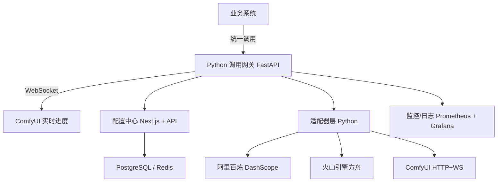

# AI 模型统一配置中心 · 详细设计文档（Next.js + Python · 终版）

> **文档说明**：本文档已完成与 2026 年 5 月各厂商最新官方 API 文档的全面对齐，完整覆盖 **阿里百炼（HappyHorse、万相2.7）**、**火山引擎方舟（Seedance 2.0）**、**ComfyUI** 三大核心能力平台的文生视频、图生视频（含首尾帧）、视频编辑、视频续写、参考生视频、音频驱动等全场景能力。所有参数、端点、认证方式均已与官方文档一一核对。


## 1. 文档概述

### 1.1 背景与目标
随着业务接入的大语言模型（LLM）、文生图（T2I）、文生视频（T2V）、图生视频（I2V）、视频编辑（Video Edit）、视频续写（Video Extension）、参考生视频（R2V）、语音合成（TTS）、ComfyUI 工作流等 AI 能力日益增多，各厂商的 API 风格、认证方式、参数命名、响应格式存在显著差异。本文档旨在设计一个**统一模型配置中心 + 智能调用网关**，采用 **Next.js (React) + Python FastAPI** 技术栈，实现：

- **一处配置，全局使用**：通过 Next.js 管理界面统一配置所有模型。
- **统一调用接口**：业务方仅需指定 `model_id`，Python 网关自动完成协议转换。
- **高可扩展**：新增厂商或新能力时，仅需配置界面，无需修改核心代码。
- **全能力覆盖**：支持文生视频、图生视频（首帧/首尾帧）、视频编辑、视频续写、参考生视频、音频驱动等完整场景。

### 1.2 术语定义
| 术语 | 说明 |
|------|------|
| 模型类型 | 业务场景分类，如 `llm`, `t2i`, `t2v`, `i2v_ff`, `i2v_fflf`, `video_edit`, `video_extend`, `r2v`, `tts`, `comfyui` |
| 厂商 | AI 服务提供商，如 `aliyun`, `volcengine_ark`, `comfyui` |
| 协议模板 | 定义厂商 API 的通用交互模式，如 `dashscope`, `volcengine_ark`, `comfyui` |
| 模型实例 | 具体的模型配置记录，包含厂商、端点、密钥、参数模板等 |
| 适配器 | Python 类，负责将统一调用请求转换为厂商特定格式 |

### 1.3 核心能力一览表

| 能力场景 | 类型标识 | 阿里百炼 HappyHorse | 阿里百炼 万相2.7 | 火山方舟 Seedance 2.0 | ComfyUI |
|----------|----------|---------------------|-----------------|---------------------|---------|
| 文生视频 | `t2v` | ✅ `happyhorse-1.0-t2v` | ✅ `wan2.7-t2v-2026-04-25` | ✅ `doubao-seedance-2-0-260128` | ✅ 工作流 |
| 图生视频-首帧 | `i2v_ff` | ❌ | ✅ `wan2.7-i2v-2026-04-25` | ✅ | ✅ 工作流 |
| 图生视频-首尾帧 | `i2v_fflf` | ❌ | ✅ | ✅ | ✅ 工作流 |
| 参考生视频 | `r2v` | ✅ `happyhorse-1.0-r2v` | ✅（media 数组） | ✅（content 数组） | ❌ |
| 视频编辑 | `video_edit` | ✅ `happyhorse-1.0-video-edit` | ✅ `wan2.7-videoedit` | ✅（content 数组含 video_url） | ❌ |
| 视频续写 | `video_extend` | ❌ | ✅（first_clip） | ✅（content 数组含 video_url） | ✅ 工作流 |
| 音频驱动 | `a2v` | ❌ | ✅（driving_audio） | ✅（audio_url） | ❌ |


## 2. 总体架构

### 2.1 架构分层



### 2.2 核心流程

#### 2.2.1 模型配置 → 生效流程
1. 管理员通过 Next.js 管理界面新增/修改模型。
2. Next.js API Routes 将配置写入 PostgreSQL，并发送 `ConfigChangeEvent` 到 Redis Pub/Sub。
3. Python 网关订阅 Redis 频道，实时更新本地缓存。
4. 配置变更自动生效，无需重启网关。

#### 2.2.2 业务调用流程
1. 业务系统发起统一请求，携带 `model_id`、`mode`（能力类型）和标准参数。
2. 网关根据 `model_id` 获取配置（厂商类型、协议模板、端点、密钥）。
3. 网关根据 `protocol` 字段加载对应适配器。
4. 适配器调用 `convert_request()` 将统一请求转换为厂商特定格式。
5. 适配器发起异步 HTTP 请求。
6. 适配器调用 `parse_response()` 将厂商响应转换为统一响应格式。


## 3. 厂商 API 全能力参数对照

### 3.1 阿里百炼 DashScope — 通用规范

#### 3.1.1 公共信息

| 项目 | 说明 |
|------|------|
| 认证方式 | API Key Bearer Token：`Authorization: Bearer sk-xxxx` |
| 异步头 | `X-DashScope-Async: enable`（必填，所有视频类 API 均为异步调用） |
| 任务创建端点（北京） | `POST https://dashscope.aliyuncs.com/api/v1/services/aigc/video-generation/video-synthesis` |
| 任务创建端点（新加坡） | `POST https://dashscope-intl.aliyuncs.com/api/v1/services/aigc/video-generation/video-synthesis` |
| 任务查询端点 | `GET https://dashscope.aliyuncs.com/api/v1/tasks/{task_id}` |
| 任务 ID 有效期 | 24 小时 |
| 生成耗时 | 通常 1-5 分钟 |
| 轮询间隔 | 推荐 15-20 秒 |
| 成功状态 | `SUCCEEDED` |
| 失败状态 | `FAILED`, `CANCELLED` |
| 运行中状态 | `PENDING`, `RUNNING` |

---

### 3.2 阿里百炼 — HappyHorse 文生视频（T2V）

#### 3.2.1 模型标识
- `happyhorse-1.0-t2v`

#### 3.2.2 功能说明
输入文本提示词，生成物理真实、运动流畅的视频内容，支持最长 5000 个非中文字符的 prompt。

#### 3.2.3 请求参数

| 参数 | 类型 | 必填 | 默认值 | 说明 |
|------|------|------|--------|------|
| `model` | string | ✅ | — | `happyhorse-1.0-t2v` |
| `input.prompt` | string | ✅ | — | 文本提示词，长度不超过 5000 非中文字符或 2500 中文字符 |
| `parameters.resolution` | string | — | `"1080P"` | 输出分辨率：`"720P"`、`"1080P"` |
| `parameters.ratio` | string | — | `"16:9"` | 视频宽高比 |
| `parameters.duration` | integer | — | `5` | 视频时长（秒） |

#### 3.2.4 响应字段

| 字段 | 说明 |
|------|------|
| `output.task_id` | 异步任务 ID，用于轮询 |
| `output.task_status` | 任务状态 |
| `output.results[].url` | 生成的视频 URL |
| `request_id` | 请求唯一标识 |

---

### 3.3 阿里百炼 — HappyHorse 参考生视频（R2V）

#### 3.3.1 模型标识
- `happyhorse-1.0-r2v`

#### 3.3.2 功能说明
支持传入**多张参考图片**，通过文本提示词描述情境，将图片中的主体角色融合产生一段流畅的视频。

#### 3.3.3 请求参数

| 参数 | 类型 | 必填 | 默认值 | 说明 |
|------|------|------|--------|------|
| `model` | string | ✅ | — | `happyhorse-1.0-r2v` |
| `input.prompt` | string | ✅ | — | 文本提示词，可通过 `[Image 1]`、`[Image 2]` 等占位符引用参考图片 |
| `input.media` | array | ✅ | — | 参考图片数组，元素类型为 `reference_image` |
| `input.media[].type` | string | ✅ | — | 固定值 `"reference_image"` |
| `input.media[].url` | string | ✅ | — | 参考图片 URL |
| `parameters.resolution` | string | — | `"1080P"` | 输出分辨率 |
| `parameters.duration` | integer | — | `5` | 视频时长（秒） |

#### 3.3.4 Prompt 占位符语法
HappyHorse R2V 支持在 prompt 中使用 `[Image N]` 占位符引用 media 数组中的参考图片：

```
"[Image 1]中身着红色旗袍的女性……她轻抬玉手展开[Image 2]中的折扇……[Image 3]中的流苏耳坠随头部转动轻盈摆动"
```

---

### 3.4 阿里百炼 — HappyHorse 视频编辑（Video Edit）

#### 3.4.1 模型标识
- `happyhorse-1.0-video-edit`

#### 3.4.2 功能说明
支持输入**视频 + 参考图片**，结合文本指令完成风格变换、局部替换等编辑任务。编辑任务耗时通常 1-5 分钟，采用异步调用方式。

#### 3.4.3 请求参数

| 参数 | 类型 | 必填 | 默认值 | 说明 |
|------|------|------|--------|------|
| `model` | string | ✅ | — | `happyhorse-1.0-video-edit` |
| `input.prompt` | string | ✅ | — | 描述编辑意图的文本提示词，如风格转换、局部替换等 |
| `input.media` | array | ✅ | — | 包含待编辑视频和参考图片 |
| `input.media[].type` | string | ✅ | — | `"video"` 或 `"reference_image"` |
| `input.media[].url` | string | ✅ | — | 素材 URL |
| `parameters.resolution` | string | — | `"720P"` | 输出分辨率 |

#### 3.4.4 Media 数组结构
```json
"media": [
  {
    "type": "video",
    "url": "https://example.com/input_video.mp4"
  },
  {
    "type": "reference_image",
    "url": "https://example.com/reference_image.webp"
  }
]
```

---

### 3.5 阿里百炼 — 万相 2.7 文生视频（T2V）

#### 3.5.1 模型标识
- `wan2.7-t2v-2026-04-25`

#### 3.5.2 功能说明
万相 2.7 T2V 模型从文本提示词生成视频，支持多镜头叙事、自定义音频、自动背景音频、负向提示词等高级能力。

#### 3.5.3 请求参数

| 参数 | 类型 | 必填 | 默认值 | 说明 |
|------|------|------|--------|------|
| `model` | string | ✅ | — | `wan2.7-t2v-2026-04-25` |
| `input.prompt` | string | ✅ | — | 文本提示词，支持时间戳格式如 `"Shot 1 [0-3s]..."` 描述多镜头 |
| `input.negative_prompt` | string | — | — | 负向提示词 |
| `input.custom_audio_url` | string | — | — | 自定义音频 URL |
| `input.auto_background_audio` | boolean | — | `false` | 是否自动生成背景音频 |
| `parameters.resolution` | string | — | `"720P"` | 输出分辨率 |
| `parameters.duration` | integer | — | `5` | 视频时长（秒） |
| `parameters.ratio` | string | — | `"16:9"` | 宽高比 |
| `parameters.seed` | integer | — | `-1` | 随机种子 |
| `parameters.watermark` | boolean | — | `false` | 是否添加水印 |
| `parameters.prompt_extend` | boolean | — | `false` | 是否开启提示词扩写 |
| `parameters.shot_type` | string | — | `"single"` | 镜头类型：`"single"` 或 `"multi"` |

> **多镜头叙事**：在 prompt 中使用自然语言控制镜头结构，如 `"Shot 1 [0-3s] Full shot: ... Shot 2 [3-6s] Medium shot: ..."`。

---

### 3.6 阿里百炼 — 万相 2.7 图生视频（I2V）

#### 3.6.1 模型标识
- `wan2.7-i2v-2026-04-25`

#### 3.6.2 功能说明
万相 2.7 I2V 支持多模态输入（文本、图像、音频、视频），执行三种主要任务：首帧生视频、首尾帧生视频、视频续写。

#### 3.6.3 请求参数

| 参数 | 类型 | 必填 | 默认值 | 说明 |
|------|------|------|--------|------|
| `model` | string | ✅ | — | `wan2.7-i2v-2026-04-25` |
| `input.prompt` | string | — | `""` | 文本提示词 |
| `input.negative_prompt` | string | — | `""` | 负向提示词 |
| `parameters.resolution` | string | — | `"720P"` | 输出分辨率 |
| `parameters.duration` | integer | — | `5` | 视频时长（秒） |
| `parameters.watermark` | boolean | — | `false` | 是否添加水印 |
| `parameters.prompt_extend` | boolean | — | `false` | 是否开启提示词扩写 |
| `parameters.return_last_frame` | boolean | — | `false` | 是否返回最后一帧图片 |

#### 3.6.4 Media 数组类型

| media type | 适用场景 | 说明 |
|------------|----------|------|
| `first_frame` | 图生视频-首帧 | 视频起始帧图片 URL |
| `last_frame` | 图生视频-首尾帧 | 视频结束帧图片 URL，与 `first_frame` 配合使用 |
| `first_clip` | 视频续写 | 续写的起始视频片段 URL |
| `reference_video` | 参考生视频 | 参考视频 URL，引导风格/运镜/视觉结构 |
| `reference_image` | 参考生视频 | 参考图片 URL，引导角色外观/风格 |
| `driving_audio` | 音频驱动 | 驱动音频 URL，实现音画同步 |

---

### 3.7 阿里百炼 — 万相 2.7 视频编辑（Video Edit）

#### 3.7.1 模型标识
- `wan2.7-videoedit`

#### 3.7.2 功能说明
万相 2.7 视频编辑模型支持多模态输入（文本/图像/视频），可完成**指令编辑**和**视频迁移**两大任务：

| 编辑方式 | 说明 | 示例 |
|----------|------|------|
| **仅指令编辑** | 仅通过文本指令修改视频内容 | "将整个画面转换为黏土风格" |
| **指令 + 参考图编辑** | 通过文本指令和参考图片修改视频内容 | "将视频中女孩的衣服替换为图片中的衣服" |

#### 3.7.3 请求参数

| 参数 | 类型 | 必填 | 默认值 | 说明 |
|------|------|------|--------|------|
| `model` | string | ✅ | — | `wan2.7-videoedit` |
| `input.prompt` | string | ✅ | — | 文本编辑指令 |
| `input.media` | array | ✅ | — | 待编辑视频 + 可选参考图片 |
| `input.media[].type` | string | ✅ | — | `"video"` 或 `"reference_image"` |
| `input.media[].url` | string | ✅ | — | 素材 URL |
| `parameters.resolution` | string | — | `"720P"` | 输出分辨率 |
| `parameters.prompt_extend` | boolean | — | `true` | 是否开启提示词扩写 |
| `parameters.watermark` | boolean | — | `true` | 是否添加水印 |

#### 3.7.4 Media 数组示例（指令 + 参考图）

```json
"media": [
  {
    "type": "video",
    "url": "https://example.com/input_video.mp4"
  },
  {
    "type": "reference_image",
    "url": "https://example.com/clothes_ref.webp"
  }
]
```


### 3.8 火山引擎方舟 — Seedance 2.0 通用规范

#### 3.8.1 公共信息

| 项目 | 说明 |
|------|------|
| 认证方式 | API Key Bearer Token：`Authorization: Bearer <API_KEY>` |
| 平台入口 | 火山方舟控制台 → API Key 管理 |
| 任务创建端点 | `POST https://ark.cn-beijing.volces.com/api/v3/contents/generations/tasks` |
| 任务查询端点 | `GET https://ark.cn-beijing.volces.com/api/v3/contents/generations/tasks/{task_id}` |
| 任务删除端点 | `DELETE https://ark.cn-beijing.volces.com/api/v3/contents/generations/tasks/{task_id}` |
| 推荐轮询间隔 | 10 秒 |
| 最大等待时间 | 1200 秒（20 分钟） |
| 视频 URL 有效期 | 24 小时 |

#### 3.8.2 Seedance 2.0 核心能力

Seedance 2.0 支持**文本、图片、音频、视频**四种模态混合输入，具备以下全场景能力：

| 能力 | 说明 | 输入约束 |
|------|------|----------|
| **文生视频（T2V）** | 纯文本生成视频 | `content[type="text"]` |
| **图生视频（I2V）** | 首帧 + 可选尾帧 + 文本 | `content[type="image_url"]` + `tag` 标记 |
| **参考生视频（R2V）** | 多模态参考素材组合 | 最多 9 张图片、3 段视频、3 段音频 |
| **视频编辑（Video Edit）** | 输入参考视频 + 编辑指令 | `content[type="video_url"]` + 编辑 prompt |
| **视频续写/延长（Video Extend）** | 基于已有视频延长 | `content[type="video_url"]` + 续写 prompt |
| **音频驱动** | 音频 + 首帧/参考图 | `content[type="audio_url"]` |

#### 3.8.3 Content 数组类型

| content type | 说明 | 参数 | 约束 |
|-------------|------|------|------|
| `text` | 文本提示词 | `text` (string) | 必填 |
| `image_url` | 图片输入 | `url` (string), `tag` (string, 可选) | `tag` 值：`"FirstFrame"`（首帧）、`"LastFrame"`（尾帧）或省略（作为参考图片） |
| `video_url` | 视频参考 | `url` (string) | 最多 3 个；用于视频编辑、延长或风格参考 |
| `audio_url` | 音频参考/驱动 | `url` (string) | 如提供音频，需至少一张参考图片或一段视频 |

#### 3.8.4 任务状态

| 状态 | 说明 | 行为 |
|------|------|------|
| `created` | 任务已提交 | 加入轮询队列 |
| `queued` | 排队中 | 继续轮询 |
| `running` | 执行中 | 继续轮询 |
| `succeeded` | 完成 | 提取 `video_url`，返回结果 |
| `failed` | 失败 | 提取错误信息 |

#### 3.8.5 核心 Parameters 参数

| 参数 | 类型 | 必填 | 默认值 | 说明 |
|------|------|------|--------|------|
| `parameters.duration` | integer | — | `5` | 视频时长（秒），取值范围 4-15 |
| `parameters.resolution` | string | — | `"1080p"` | 输出分辨率：`"480p"`、`"720p"`、`"1080p"`、`"2K"` |
| `parameters.aspect_ratio` | string | — | `"16:9"` | 宽高比：`"1:1"`、`"4:3"`、`"3:4"`、`"9:16"`、`"16:9"`、`"21:9"`、`"adaptive"` |
| `parameters.seed` | integer | — | `-1`（随机） | 随机种子 |
| `parameters.guidance_scale` | float | — | `7.5` | 引导比例 |
| `parameters.num_inference_steps` | integer | — | `50` | 推理步数 |
| `parameters.generate_audio` | boolean | — | `false` | 是否自动生成音频（音画同步） |
| `parameters.return_last_frame` | boolean | — | `false` | 是否返回最后一帧 |

#### 3.8.6 Prompt 占位符语法（R2V / 视频编辑）

Seedance 2.0 支持在 prompt 中使用 `[Image1]`、`[Video1]`、`[Audio1]` 占位符，引用 content 数组中的参考素材：

```
"The character from [Image1] performs the dance from [Video1]."
```

视频编辑模式下，通过自然语言描述所需修改：

```
"Replace the perfume in [Video1] with the face cream from [Image1], keeping all original motion."
```
### 3.9 硅基流动 — LLM（OpenAI 兼容）

#### 3.9.1 概述
硅基流动提供大语言模型的 OpenAI 兼容 API，支持对话补全、流式输出、函数调用等标准能力。所有模型均通过统一的 Chat Completions 端点访问。

#### 3.9.2 公共信息

| 项目 | 说明 |
|------|------|
| 认证方式 | API Key Bearer Token：`Authorization: Bearer sk-xxxx` |
| 基础 URL | `https://api.siliconflow.cn/v1` |
| Chat Completions 端点 | `POST https://api.siliconflow.cn/v1/chat/completions` |
| 流式支持 | `stream: true`，SSE 格式，以 `data:` 前缀返回 |
| 超时建议 | 30-60 秒（普通请求）；300 秒（长文本） |

#### 3.9.3 请求参数

| 参数 | 类型 | 必填 | 默认值 | 说明 |
|------|------|------|--------|------|
| `model` | string | ✅ | — | 模型名称，如 `Qwen/Qwen3-235B-A22B`、`deepseek-ai/DeepSeek-R1` 等 |
| `messages` | array | ✅ | — | 对话消息列表，每个元素含 `role` 和 `content` |
| `temperature` | float | — | `0.7` | 采样温度，0-2 |
| `top_p` | float | — | `1.0` | 核采样 |
| `max_tokens` | integer | — | `1024` | 最大输出 token 数 |
| `stream` | boolean | — | `false` | 是否流式返回 |
| `stop` | string/array | — | — | 停止词 |
| `frequency_penalty` | float | — | `0` | 频率惩罚 |
| `presence_penalty` | float | — | `0` | 存在惩罚 |

#### 3.9.4 响应格式
- 非流式：返回标准 `choices[0].message.content` 结构。
- 流式：SSE 事件流，每行以 `data: ` 开头，以 `data: [DONE]` 结束。

#### 3.9.5 适用协议
适配器使用 `openai` 协议模板，与火山方舟 LLM 等 OpenAI 兼容厂商共用同一套适配器逻辑。

---


## 4. 参数映射模板（完整修正版）

### 4.1 阿里百炼 HappyHorse 文生视频（T2V）

```json
{
  "protocol": "dashscope",
  "requestTemplate": {
    "model": "happyhorse-1.0-t2v",
    "input": {
      "prompt": "{{ prompt }}"
    },
    "parameters": {
      "resolution": "{{ resolution | default('1080P') }}",
      "ratio": "{{ ratio | default('16:9') }}",
      "duration": {{ duration | default(5) | int }}
    }
  },
  "responseTemplate": {
    "task_id": "{{ output.task_id }}",
    "request_id": "{{ request_id }}"
  },
  "async": true,
  "polling": {
    "taskIdPath": "output.task_id",
    "statusPath": "output.task_status",
    "resultPath": "output.results",
    "pollUrl": "https://dashscope.aliyuncs.com/api/v1/tasks/{{ task_id }}",
    "successStatuses": ["SUCCEEDED"],
    "failureStatuses": ["FAILED", "CANCELLED"],
    "runningStatuses": ["PENDING", "RUNNING"],
    "intervalMs": 15000,
    "maxAttempts": 120,
    "backoffMultiplier": 1.2
  },
  "auth": {
    "type": "bearer",
    "asyncHeader": "X-DashScope-Async",
    "asyncValue": "enable"
  }
}
```

### 4.2 阿里百炼 HappyHorse 参考生视频（R2V）

```json
{
  "protocol": "dashscope",
  "requestTemplate": {
    "model": "happyhorse-1.0-r2v",
    "input": {
      "prompt": "{{ prompt }}",
      "media": [
        
        {"type": "reference_image", "url": "{{ img.url }}"},
        
      ]
    },
    "parameters": {
      "resolution": "{{ resolution | default('1080P') }}",
      "duration": {{ duration | default(5) | int }}
    }
  },
  "responseTemplate": {
    "task_id": "{{ output.task_id }}",
    "request_id": "{{ request_id }}"
  },
  "async": true,
  "polling": {
    "taskIdPath": "output.task_id",
    "statusPath": "output.task_status",
    "resultPath": "output.results",
    "pollUrl": "https://dashscope.aliyuncs.com/api/v1/tasks/{{ task_id }}",
    "successStatuses": ["SUCCEEDED"],
    "failureStatuses": ["FAILED", "CANCELLED"],
    "runningStatuses": ["PENDING", "RUNNING"],
    "intervalMs": 15000,
    "maxAttempts": 120,
    "backoffMultiplier": 1.2
  },
  "auth": {
    "type": "bearer",
    "asyncHeader": "X-DashScope-Async",
    "asyncValue": "enable"
  }
}
```

### 4.3 阿里百炼 HappyHorse 视频编辑（Video Edit）

```json
{
  "protocol": "dashscope",
  "requestTemplate": {
    "model": "happyhorse-1.0-video-edit",
    "input": {
      "prompt": "{{ prompt }}",
      "media": [
        {"type": "video", "url": "{{ video_url }}"},
        
        {"type": "reference_image", "url": "{{ reference_image_url }}"},
        
      ]
    },
    "parameters": {
      "resolution": "{{ resolution | default('720P') }}"
    }
  },
  "responseTemplate": {
    "task_id": "{{ output.task_id }}",
    "request_id": "{{ request_id }}"
  },
  "async": true,
  "polling": {
    "taskIdPath": "output.task_id",
    "statusPath": "output.task_status",
    "resultPath": "output.results",
    "pollUrl": "https://dashscope.aliyuncs.com/api/v1/tasks/{{ task_id }}",
    "successStatuses": ["SUCCEEDED"],
    "failureStatuses": ["FAILED", "CANCELLED"],
    "runningStatuses": ["PENDING", "RUNNING"],
    "intervalMs": 15000,
    "maxAttempts": 120,
    "backoffMultiplier": 1.2
  },
  "auth": {
    "type": "bearer",
    "asyncHeader": "X-DashScope-Async",
    "asyncValue": "enable"
  }
}
```

### 4.4 阿里百炼 万相 2.7 文生视频（T2V）

```json
{
  "protocol": "dashscope",
  "requestTemplate": {
    "model": "wan2.7-t2v-2026-04-25",
    "input": {
      "prompt": "{{ prompt }}",
      
      "negative_prompt": "{{ negative_prompt }}",
      
      
      "custom_audio_url": "{{ custom_audio_url }}",
      
      "auto_background_audio": {{ auto_background_audio | default(false) | lower }}
    },
    "parameters": {
      "resolution": "{{ resolution | default('720P') }}",
      "duration": {{ duration | default(5) | int }},
      "ratio": "{{ ratio | default('16:9') }}",
      "seed": {{ seed | default(-1) | int }},
      "watermark": {{ watermark | default(false) | lower }},
      "prompt_extend": {{ prompt_extend | default(false) | lower }},
      "shot_type": "{{ shot_type | default('single') }}"
    }
  },
  "responseTemplate": {
    "task_id": "{{ output.task_id }}",
    "request_id": "{{ request_id }}"
  },
  "async": true,
  "polling": {
    "taskIdPath": "output.task_id",
    "statusPath": "output.task_status",
    "resultPath": "output.results",
    "pollUrl": "https://dashscope.aliyuncs.com/api/v1/tasks/{{ task_id }}",
    "successStatuses": ["SUCCEEDED"],
    "failureStatuses": ["FAILED", "CANCELLED"],
    "runningStatuses": ["PENDING", "RUNNING"],
    "intervalMs": 15000,
    "maxAttempts": 120,
    "backoffMultiplier": 1.2
  },
  "auth": {
    "type": "bearer",
    "asyncHeader": "X-DashScope-Async",
    "asyncValue": "enable"
  }
}
```

### 4.5 阿里百炼 万相 2.7 图生视频（I2V / R2V / 视频续写 / 音频驱动 统一模板）

```json
{
  "protocol": "dashscope",
  "requestTemplate": {
    "model": "wan2.7-i2v-2026-04-25",
    "input": {
      "prompt": "{{ prompt | default('') }}",
      "negative_prompt": "{{ negative_prompt | default('') }}"
    },
    "media": [
      
      {"type": "first_frame", "url": "{{ first_frame_url }}"},
      
      
      {"type": "last_frame", "url": "{{ last_frame_url }}"},
      
      
      {"type": "first_clip", "url": "{{ first_clip_url }}"},
      
      
      
      {"type": "reference_video", "url": "{{ video.url }}"},
      
      
      
      
      {"type": "reference_image", "url": "{{ ref_img.url }}"},
      
      
      
      {"type": "driving_audio", "url": "{{ audio_url }}"},
      
    ],
    "parameters": {
      "resolution": "{{ resolution | default('720P') }}",
      "duration": {{ duration | default(5) | int }},
      "watermark": {{ watermark | default(false) | lower }},
      "prompt_extend": {{ prompt_extend | default(false) | lower }},
      "return_last_frame": {{ return_last_frame | default(false) | lower }}
    }
  },
  "responseTemplate": {
    "task_id": "{{ output.task_id }}",
    "request_id": "{{ request_id }}"
  },
  "async": true,
  "polling": {
    "taskIdPath": "output.task_id",
    "statusPath": "output.task_status",
    "resultPath": "output.results",
    "pollUrl": "https://dashscope.aliyuncs.com/api/v1/tasks/{{ task_id }}",
    "successStatuses": ["SUCCEEDED"],
    "failureStatuses": ["FAILED", "CANCELLED"],
    "runningStatuses": ["PENDING", "RUNNING"],
    "intervalMs": 15000,
    "maxAttempts": 120,
    "backoffMultiplier": 1.2
  },
  "auth": {
    "type": "bearer",
    "asyncHeader": "X-DashScope-Async",
    "asyncValue": "enable"
  }
}
```

### 4.6 阿里百炼 万相 2.7 视频编辑（Video Edit）

```json
{
  "protocol": "dashscope",
  "requestTemplate": {
    "model": "wan2.7-videoedit",
    "input": {
      "prompt": "{{ prompt }}",
      "media": [
        {"type": "video", "url": "{{ video_url }}"},
        
        {"type": "reference_image", "url": "{{ reference_image_url }}"},
        
      ]
    },
    "parameters": {
      "resolution": "{{ resolution | default('720P') }}",
      "prompt_extend": {{ prompt_extend | default(true) | lower }},
      "watermark": {{ watermark | default(true) | lower }}
    }
  },
  "responseTemplate": {
    "task_id": "{{ output.task_id }}",
    "request_id": "{{ request_id }}"
  },
  "async": true,
  "polling": {
    "taskIdPath": "output.task_id",
    "statusPath": "output.task_status",
    "resultPath": "output.results",
    "pollUrl": "https://dashscope.aliyuncs.com/api/v1/tasks/{{ task_id }}",
    "successStatuses": ["SUCCEEDED"],
    "failureStatuses": ["FAILED", "CANCELLED"],
    "runningStatuses": ["PENDING", "RUNNING"],
    "intervalMs": 15000,
    "maxAttempts": 120,
    "backoffMultiplier": 1.2
  },
  "auth": {
    "type": "bearer",
    "asyncHeader": "X-DashScope-Async",
    "asyncValue": "enable"
  }
}
```

### 4.7 火山方舟 Seedance 2.0（全能力统一模板）

```json
{
  "protocol": "volcengine_ark",
  "requestTemplate": {
    "model": "{{ model_id }}",
    "content": [
      {
        "type": "text",
        "text": "{{ prompt }}"
      },
      
      {
        "type": "image_url",
        "url": "{{ first_frame_url }}",
        "tag": "FirstFrame"
      },
      
      
      {
        "type": "image_url",
        "url": "{{ last_frame_url }}",
        "tag": "LastFrame"
      },
      
      
      
      {
        "type": "image_url",
        "url": "{{ img.url }}"
      },
      
      
      
      
      {
        "type": "video_url",
        "url": "{{ video.url }}"
      },
      
      
      
      {
        "type": "audio_url",
        "url": "{{ audio_url }}"
      },
      
    ],
    "parameters": {
      "duration": {{ duration | default(5) | int }},
      "resolution": "{{ resolution | default('1080p') }}",
      "aspect_ratio": "{{ aspect_ratio | default('16:9') }}",
      "seed": {{ seed | default(-1) | int }},
      "guidance_scale": {{ guidance_scale | default(7.5) }},
      "num_inference_steps": {{ num_inference_steps | default(50) | int }},
      "generate_audio": {{ generate_audio | default(false) | lower }},
      "return_last_frame": {{ return_last_frame | default(false) | lower }}
    }
  },
  "responseTemplate": {
    "task_id": "{{ id }}"
  },
  "async": true,
  "polling": {
    "taskIdPath": "id",
    "statusPath": "status",
    "resultPath": "video_url",
    "pollUrl": "https://ark.cn-beijing.volces.com/api/v3/contents/generations/tasks/{{ task_id }}",
    "successStatuses": ["succeeded"],
    "failureStatuses": ["failed"],
    "runningStatuses": ["created", "queued", "running"],
    "intervalMs": 10000,
    "maxAttempts": 120,
    "maxWaitSeconds": 1200
  },
  "auth": {
    "type": "bearer",
    "tokenPath": "apiKey"
  }
}
```

### 4.8 火山方舟 Seedream 文生图

```json
{
  "protocol": "volcengine_ark",
  "requestTemplate": {
    "model": "{{ model_id }}",
    "prompt": "{{ prompt }}",
    "size": "{{ size | default('1024x1024') }}",
    "n": {{ n | default(1) | int }},
    "seed": {{ seed | default(-1) | int }},
    "response_format": "{{ response_format | default('url') }}"
  },
  "responseTemplate": {
    "images": "{{ data | map(attribute='url') | list | tojson }}"
  },
  "async": false,
  "auth": {
    "type": "bearer",
    "tokenPath": "apiKey"
  }
}
```

### 4.9 ComfyUI

```json
{
  "protocol": "comfyui",
  "workflowTemplate": {
    "prompt": {
      "1": {"inputs": {"text": "{{ prompt }}", "clip": ["4", 1]}, "class_type": "CLIPTextEncode"},
      "3": {"inputs": {"seed": {{ seed | default(0) | int }}, "steps": 20, "cfg": 8.0, "sampler_name": "euler", "scheduler": "normal", "denoise": 1.0, "model": ["4", 0], "positive": ["1", 0], "negative": ["6", 0], "latent_image": ["5", 0]}, "class_type": "KSampler"},
      "4": {"inputs": {"ckpt_name": "{{ checkpoint | default('sd_xl_base_1.0.safetensors') }}"}, "class_type": "CheckpointLoaderSimple"},
      "5": {"inputs": {"width": {{ width | default(1024) | int }}, "height": {{ height | default(1024) | int }}, "batch_size": 1}, "class_type": "EmptyLatentImage"},
      "6": {"inputs": {"text": "text, watermark", "clip": ["4", 1]}, "class_type": "CLIPTextEncode"},
      "9": {"inputs": {"filename_prefix": "ComfyUI", "images": ["8", 0]}, "class_type": "SaveImage"}
    }
  },
  "requestTemplate": {
    "prompt": {{ workflowTemplate.prompt | tojson }}
  },
  "responseTemplate": {
    "task_id": "{{ prompt_id }}"
  },
  "async": true,
  "polling": {
    "taskIdPath": "prompt_id",
    "statusPath": "status",
    "pollUrl": "{{ endpoint }}/history/{{ task_id }}",
    "successStatuses": ["success"],
    "failureStatuses": ["error"],
    "runningStatuses": ["pending"],
    "intervalMs": 1500,
    "maxAttempts": 200,
    "backoffMultiplier": 1.2
  },
  "websocket": {
    "enabled": true,
    "url": "{{ endpoint }}/ws",
    "clientId": "{{ client_id }}",
    "events": ["status", "execution_start", "executing", "progress", "executed", "execution_cached"]
  },
  "outputFileBaseUrl": "{{ endpoint }}/view",
  "fileAutoTransfer": {
    "enabled": true,
    "targetStorage": "minio",
    "ttlDays": 30
  }
}
```

### 4.9 硅基流动 LLM（OpenAI 兼容）

```json
{
  "protocol": "openai",
  "requestTemplate": {
    "model": "{{ model_id }}",
    "messages": {{ messages | tojson }},
    "temperature": {{ temperature | default(0.7) }},
    "top_p": {{ top_p | default(1.0) }},
    "max_tokens": {{ max_tokens | default(1024) | int }},
    "stream": {{ stream | default(false) | lower }},
    
    "stop": {{ stop | tojson }},
    
    "frequency_penalty": {{ frequency_penalty | default(0) }},
    "presence_penalty": {{ presence_penalty | default(0) }}
  },
  "responseTemplate": {
    "id": "{{ id }}",
    "choices": {{ choices | tojson }},
    "usage": {{ usage | tojson }}
  },
  "async": false,
  "stream": {
    "enabled": "{{ stream }}",
    "eventPrefix": "data: ",
    "doneSignal": "data: [DONE]"
  },
  "auth": {
    "type": "bearer",
    "tokenPath": "apiKey"
  }
}
```

## 5. 调用网关（Python FastAPI）

### 5.1 项目结构

```
gateway/
├── app/
│   ├── main.py
│   ├── config.py
│   ├── dependencies.py
│   ├── models/
│   │   ├── unified.py          # 统一请求/响应模型
│   │   └── internal.py
│   ├── adapters/
│   │   ├── base.py
│   │   ├── factory.py
│   │   ├── openai_like.py      # 硅基流动 LLM、方舟 LLM 等
│   │   ├── dashscope.py        # HappyHorse + 万相 2.7
│   │   ├── volcengine_ark.py   # Seedance 2.0 + Seedream
│   │   └── comfyui.py
│   ├── services/
│   │   ├── config_cache.py     # Redis Pub/Sub 热更新
│   │   ├── async_poller.py     # 异步任务轮询器
│   │   ├── task_state.py       # 任务状态机
│   │   ├── sse_handler.py      # SSE 流式处理
│   │   └── metrics.py          # Prometheus 指标
│   ├── routers/
│   │   ├── chat.py
│   │   ├── images.py
│   │   ├── videos.py
│   │   ├── audio.py
│   │   ├── comfyui.py
│   │   └── tasks.py
│   └── utils/
│       ├── http_client.py
│       ├── crypto.py
│       ├── jinja_mapper.py
│       └── jsonpath.py
├── requirements.txt
└── Dockerfile
```

### 5.2 适配器工厂

```python
from .dashscope import DashscopeAdapter
from .volcengine_ark import VolcengineArkAdapter
from .comfyui import ComfyuiAdapter

ADAPTER_MAP = {
    "dashscope": DashscopeAdapter,
    "volcengine_ark": VolcengineArkAdapter,
    "comfyui": ComfyuiAdapter,
}

def get_adapter(config: dict) -> ModelAdapter:
    protocol = config.get("protocol", "custom")
    if protocol in ADAPTER_MAP:
        return ADAPTER_MAP[protocol](config)
    raise ValueError(f"Unsupported protocol: {protocol}")
```

### 5.3 异步任务状态机

```python
class TaskStatus(str, Enum):
    PENDING = "pending"
    QUEUED = "queued"
    RUNNING = "running"
    SUCCEEDED = "succeeded"
    FAILED = "failed"
    CANCELLED = "cancelled"
    TIMEOUT = "timeout"
    UNKNOWN = "unknown"

# DashScope 状态映射（HappyHorse + 万相 2.7 通用）
DASHSCOPE_STATUS_MAP = {
    "PENDING": "pending",
    "RUNNING": "running",
    "SUCCEEDED": "succeeded",
    "FAILED": "failed",
    "CANCELLED": "cancelled",
}

# 火山方舟 Seedance 状态映射
ARK_STATUS_MAP = {
    "created": "pending",
    "queued": "queued",
    "running": "running",
    "succeeded": "succeeded",
    "failed": "failed",
}
```

### 5.4 DashScope 适配器

```python
class DashscopeAdapter(ModelAdapter):
    """统一适配 HappyHorse 和万相 2.7 系列模型"""

    async def handle_stream(self, response: httpx.Response):
        """DashScope 流式输出不使用 data: 前缀，直接返回 JSON 行"""
        async for line in response.aiter_lines():
            if not line.strip():
                continue
            try:
                data = json.loads(line)
                yield f"data: {json.dumps(data)}\n\n"
            except json.JSONDecodeError:
                continue
        yield "data: [DONE]\n\n"

    def build_headers(self) -> dict:
        headers = super().build_headers()
        headers["X-DashScope-Async"] = "enable"
        return headers

    async def poll_task(self, task_id: str) -> dict:
        """统一的 DashScope 任务轮询逻辑（HappyHorse + 万相 2.7 通用）"""
        poll_url = f"https://dashscope.aliyuncs.com/api/v1/tasks/{task_id}"
        for attempt in range(self.max_attempts):
            response = await self.http_client.get(
                poll_url,
                headers={"Authorization": f"Bearer {self.api_key}"}
            )
            data = response.json()
            status = data.get("output", {}).get("task_status", "UNKNOWN")

            if status in ["SUCCEEDED"]:
                return self.parse_result(data)
            elif status in ["FAILED", "CANCELLED"]:
                raise TaskFailedException(status, data)
            else:
                await asyncio.sleep(self.poll_interval_ms / 1000)
        raise TaskTimeoutException(task_id)
```

### 5.5 ComfyUI 适配器

```python
class ComfyuiAdapter(ModelAdapter):
    async def parse_result(self, raw_response: dict) -> dict:
        outputs = raw_response.get("outputs", {})
        all_media = []
        for node_id, node_output in outputs.items():
            for media_type in ["images", "gifs", "3ds"]:
                if media_type in node_output:
                    for media in node_output[media_type]:
                        filename = media["filename"]
                        subfolder = media.get("subfolder", "")
                        media_type_dir = media.get("type", "")
                        temp_url = self._build_view_url(filename, subfolder, media_type_dir)
                        permanent_url = await transfer_to_minio(temp_url, ttl_days=30)
                        all_media.append({
                            "node_id": node_id,
                            "type": media_type,
                            "url": permanent_url,
                            "filename": filename
                        })
        return {"media": all_media}
```
### 5.6 OpenAI 兼容适配器（硅基流动 LLM / 方舟 LLM 等）

```python
class OpenAILikeAdapter(ModelAdapter):
    """OpenAI 兼容协议适配器，适用于硅基流动、火山方舟 LLM 等"""

    async def handle_stream(self, response: httpx.Response):
        """SSE 流式输出，data: 前缀，以 [DONE] 结束"""
        async for line in response.aiter_lines():
            if not line.strip():
                continue
            yield f"{line}\n\n"
```


## 6. 统一调用 API 示例

### 6.1 HappyHorse 文生视频

```bash
curl -X POST http://gateway/v1/videos/generations \
  -H "Content-Type: application/json" \
  -H "X-API-Key: <your-api-key>" \
  -d '{
    "model_id": "happyhorse-t2v-prod",
    "mode": "t2v",
    "prompt": "一座由硬纸板和瓶盖搭建的微型城市，在夜晚焕发出生机。一列硬纸板火车缓缓驶过，小灯点缀其间，照亮前路。",
    "duration": 5,
    "resolution": "1080P",
    "ratio": "16:9"
  }'
```

### 6.2 HappyHorse 参考生视频

```bash
curl -X POST http://gateway/v1/videos/generations \
  -H "Content-Type: application/json" \
  -H "X-API-Key: <your-api-key>" \
  -d '{
    "model_id": "happyhorse-r2v-prod",
    "mode": "r2v",
    "prompt": "[Image 1]中身着红色旗袍的女性……她轻抬玉手展开[Image 2]中的折扇……[Image 3]中的流苏耳坠随头部转动轻盈摆动",
    "reference_images": [
      {"url": "https://example.com/ref1.png"},
      {"url": "https://example.com/ref2.png"},
      {"url": "https://example.com/ref3.png"}
    ],
    "duration": 5,
    "resolution": "1080P"
  }'
```

### 6.3 HappyHorse 视频编辑

```bash
curl -X POST http://gateway/v1/videos/generations \
  -H "Content-Type: application/json" \
  -H "X-API-Key: <your-api-key>" \
  -d '{
    "model_id": "happyhorse-video-edit-prod",
    "mode": "video_edit",
    "prompt": "让视频中的马头人身角色穿上图片中的条纹毛衣",
    "video_url": "https://example.com/input_video.mp4",
    "reference_image_url": "https://example.com/striped_sweater.webp",
    "resolution": "720P"
  }'
```

### 6.4 万相 2.7 多镜头叙事文生视频

```bash
curl -X POST http://gateway/v1/videos/generations \
  -H "Content-Type: application/json" \
  -H "X-API-Key: <your-api-key>" \
  -d '{
    "model_id": "wan2.7-t2v-prod",
    "mode": "t2v",
    "prompt": "Shot 1 [0-3s] Full shot: On a rainy New York street, neon lights flicker as a detective in a black trench coat walks briskly. Shot 2 [3-6s] Medium shot: The detective enters an old building, his coat soaked from the rain. Shot 3 [6-9s] Close-up: The detective\s gaze is firm and focused.",
    "duration": 9,
    "resolution": "720P",
    "shot_type": "multi"
  }'
```

### 6.5 万相 2.7 视频编辑（风格转换）

```bash
curl -X POST http://gateway/v1/videos/generations \
  -H "Content-Type: application/json" \
  -H "X-API-Key: <your-api-key>" \
  -d '{
    "model_id": "wan2.7-videoedit-prod",
    "mode": "video_edit",
    "prompt": "将整个画面转换为黏土风格",
    "video_url": "https://example.com/input_video.mp4",
    "resolution": "720P",
    "prompt_extend": true,
    "watermark": true
  }'
```

### 6.6 万相 2.7 视频编辑（局部替换）

```bash
curl -X POST http://gateway/v1/videos/generations \
  -H "Content-Type: application/json" \
  -H "X-API-Key: <your-api-key>" \
  -d '{
    "model_id": "wan2.7-videoedit-prod",
    "mode": "video_edit",
    "prompt": "将视频中女孩的衣服替换为图片中的衣服",
    "video_url": "https://example.com/girl_video.mp4",
    "reference_image_url": "https://example.com/new_clothes.png",
    "resolution": "720P"
  }'
```

### 6.7 万相 2.7 视频续写

```bash
curl -X POST http://gateway/v1/videos/generations \
  -H "Content-Type: application/json" \
  -H "X-API-Key: <your-api-key>" \
  -d '{
    "model_id": "wan2.7-i2v-prod",
    "mode": "video_extend",
    "prompt": "continue the scene with dramatic lighting and a slow camera pan",
    "first_clip_url": "https://example.com/input_clip.mp4",
    "duration": 10,
    "resolution": "720P",
    "return_last_frame": true
  }'
```

### 6.8 Seedance 2.0 文生视频

```bash
curl -X POST http://gateway/v1/videos/generations \
  -H "Content-Type: application/json" \
  -H "X-API-Key: <your-api-key>" \
  -d '{
    "model_id": "doubao-seedance-2-0-260128",
    "mode": "t2v",
    "prompt": "竞技级双人花样滑冰现场。开场低机位跟随冰刀滑行，冰屑与反光细节清晰……",
    "duration": 8,
    "resolution": "1080p",
    "generate_audio": true
  }'
```

### 6.9 Seedance 2.0 视频编辑

```bash
curl -X POST http://gateway/v1/videos/generations \
  -H "Content-Type: application/json" \
  -H "X-API-Key: <your-api-key>" \
  -d '{
    "model_id": "doubao-seedance-2-0-260128",
    "mode": "video_edit",
    "prompt": "Replace the perfume in [Video1] with the face cream from [Image1], keeping all original motion",
    "reference_videos": [{"url": "https://example.com/perfume_ad.mp4"}],
    "reference_images": [{"url": "https://example.com/face_cream.jpg"}],
    "duration": 5,
    "resolution": "1080p"
  }'
```

### 6.10 Seedance 2.0 视频续写

```bash
curl -X POST http://gateway/v1/videos/generations \
  -H "Content-Type: application/json" \
  -H "X-API-Key: <your-api-key>" \
  -d '{
    "model_id": "doubao-seedance-2-0-260128",
    "mode": "video_extend",
    "prompt": "Continue this scene: the detective enters the building and discovers a hidden room with flickering lights",
    "reference_videos": [{"url": "https://example.com/detective_intro.mp4"}],
    "duration": 8,
    "resolution": "1080p"
  }'
```

### 6.11 Seedance 2.0 参考生视频（R2V）

```bash
curl -X POST http://gateway/v1/videos/generations \
  -H "Content-Type: application/json" \
  -H "X-API-Key: <your-api-key>" \
  -d '{
    "model_id": "doubao-seedance-2-0-260128",
    "mode": "r2v",
    "prompt": "The character from [Image1] performs the dance from [Video1] in the environment shown in [Image2], with the music style from [Audio1]",
    "reference_images": [
      {"url": "https://example.com/character.jpg"},
      {"url": "https://example.com/environment.jpg"}
    ],
    "reference_videos": [{"url": "https://example.com/dance_reference.mp4"}],
    "audio_url": "https://example.com/music.mp3",
    "duration": 10,
    "resolution": "1080p",
    "generate_audio": true
  }'
```

### 6.12 火山方舟文生图（Seedream）

```bash
curl -X POST http://gateway/v1/images/generations \
  -H "Content-Type: application/json" \
  -H "X-API-Key: <your-api-key>" \
  -d '{
    "model_id": "doubao-seedream-4-0",
    "prompt": "一只可爱的猫咪，赛博朋克风格",
    "size": "1024x1024",
    "n": 1
  }'
```

**响应**：
```json
{
  "images": ["https://minio.internal/ai-outputs/xxx.jpg"]
}
```


## 7. 非功能性设计

### 7.1 文件自动转存策略

| 厂商 | 文件类型 | 原始有效期 | 网关处理 |
|------|----------|-----------|----------|
| 阿里百炼（HappyHorse） | 视频 URL | 24 小时 | 异步轮询完成后下载并转存 MinIO |
| 阿里百炼（万相 2.7） | 视频 URL | 24 小时 | 异步轮询完成后下载并转存 MinIO |
| 火山方舟（Seedance 2.0） | 视频 URL | 24 小时 | 异步轮询完成后下载并转存 MinIO |
| DashScope TTS | 音频二进制 | 即时返回 | 转存 MinIO |
| ComfyUI | 图片/视频/3D 文件 | 依赖本地实例存活 | 从 `/view` 接口获取临时 URL 后立即转存 MinIO |

### 7.2 URL 过期保护

```python
import httpx
from io import BytesIO
from uuid import uuid4
from datetime import timedelta

async def auto_transfer_file(temp_url: str, ttl_days: int = 30) -> str:
    async with httpx.AsyncClient() as client:
        resp = await client.get(temp_url)
        resp.raise_for_status()
    file_data = resp.content
    content_type = resp.headers.get("content-type", "application/octet-stream")
    ext = content_type.split("/")[-1]
    object_key = f"ai-outputs/{uuid4()}.{ext}"
    await minio_client.put_object(
        "ai-bucket", object_key,
        BytesIO(file_data), len(file_data),
        content_type=content_type
    )
    return minio_client.presigned_get_object(
        "ai-bucket", object_key,
        expires=timedelta(days=ttl_days)
    )
```


## 附录 A：设计评审结论

本设计文档经过与 2026 年 5 月各厂商最新官方 API 文档的严格核对，核心架构（适配器工厂 + Jinja2 模板引擎 + Redis Pub/Sub 热更新）正确可行。相比前一版本，本文档进行了以下关键修正与补充：

### DashScope 侧（阿里百炼）
- ✅ **新增 HappyHorse 文生视频（T2V）**：`happyhorse-1.0-t2v` 模型，完整参数 `input.prompt`、`parameters.resolution`、`parameters.ratio`、`parameters.duration`。
- ✅ **新增 HappyHorse 参考生视频（R2V）**：`happyhorse-1.0-r2v` 模型，支持多图参考 + `[Image N]` 占位符语法。
- ✅ **新增 HappyHorse 视频编辑**：`happyhorse-1.0-video-edit` 模型，支持指令 + 参考图的视频编辑任务。
- ✅ **修正 DashScope 流式格式**（移除错误的 `data:` 前缀，改为直接 JSON 行解析）。
- ✅ **新增万相 2.7 文生视频（T2V）**：`wan2.7-t2v-2026-04-25`，支持多镜头叙事（时间戳格式 `"Shot N [Ss-Es] ..."`）、自定义音频、自动背景音频、负向提示词。
- ✅ **新增万相 2.7 视频编辑**：`wan2.7-videoedit`，支持「仅指令编辑」和「指令 + 参考图编辑」两种方式。
- ✅ **完善万相 2.7 I2V 全参数**：`first_frame`、`last_frame`、`first_clip`、`reference_video`、`reference_image`、`driving_audio`、`return_last_frame`。

### 火山方舟侧
- ✅ **新增 Seedance 2.0 全场景覆盖**：T2V、I2V（首帧/首尾帧）、R2V（多模态参考）、Video Edit（视频编辑）、Video Extension（视频续写）、音频驱动。
- ✅ **修正 Seedance 请求结构**：从错误的 `messages` 格式改为独立的 `content` 数组 + `parameters` 结构，支持 `text`/`image_url`/`video_url`/`audio_url` 四种类型。
- ✅ **新增 `[ImageN]`、`[VideoN]`、`[AudioN]` 占位符语法**说明。
- ✅ **更新即梦文生图**（迁移至方舟 API Bearer 认证，废弃旧版 HMAC-SHA256）。
- ✅ **完善异步任务状态映射**：`created` → `pending`，`queued` → `queued`，`running` → `running`。

### ComfyUI 侧
- ✅ **修正输出提取**：遍历所有节点的 `images`/`gifs`/`3ds` 数组。

### 非功能性
- ✅ **明确各厂商文件临时 URL 有效期**：DashScope 24 小时、Seedance 2.0 24 小时。
- ✅ **统一异步任务轮询策略**，对齐三家厂商的状态枚举与轮询间隔。
- ✅ **设计统一文件转存机制**（MinIO）。

文档内容已可直接用于指导开发实施。


## 附录 B：配置管理模块（Next.js + Prisma）

### B.1 数据模型（Prisma Schema）

```prisma
model ProviderMeta {
  provider        String   @id
  name            String
  icon            String?
  protocol        String   @default("custom") // dashscope, volcengine_ark, comfyui, custom
  authType        String   // bearer
  authLocation    String   // header
  authKeyName     String
  serviceLine     String?
  description     String?
  createdAt       DateTime @default(now())
  updatedAt       DateTime @updatedAt
  models          ModelConfig[]
}

model ModelConfig {
  id              Int      @id @default(autoincrement())
  modelId         String   @unique
  name            String
  provider        String
  type            String   // llm, t2i, t2v, i2v_ff, i2v_fflf, video_edit, video_extend, r2v, a2v, tts, comfyui
  protocol        String   @default("custom")
  endpoint        String
  apiKey          String   // 加密存储（AES-256-GCM）
  env             String   @default("prod")
  status          String   @default("offline")
  timeout         Int      @default(30)
  retryTimes      Int      @default(3)
  proxy           String?
  tags            Json     @default("[]")
  description     String?
  paramsSchema    Json     // Jinja2 参数映射模板 + 异步轮询配置
  customHeaders   Json?
  version         Int      @default(1)
  grayRatio       Int      @default(0)
  grayVersion     Int?
  createdAt       DateTime @default(now())
  updatedAt       DateTime @updatedAt
}

model ModelConfigHistory {
  id              Int      @id @default(autoincrement())
  modelId         String
  snapshot        Json
  version         Int
  releasedBy      String?
  releasedAt      DateTime @default(now())
}
```