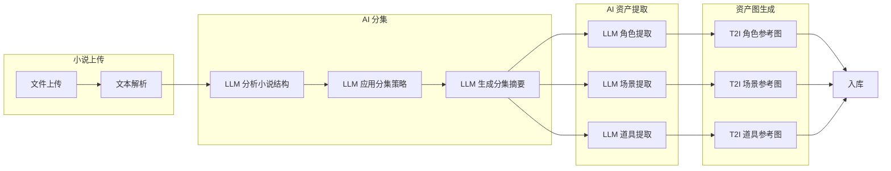
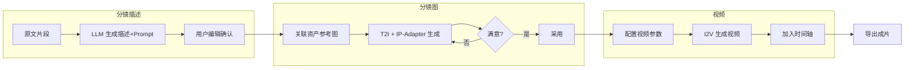
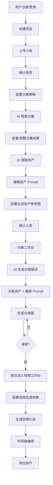

# 共享上下文

> 本文件包含所有模块共享的通用内容，是各模块开发的公共依赖。每个模块文件已索引本文档的相关章节。

---

## 目录

1. [全局布局框架](#1-全局布局框架)
2. [状态机](#2-状态机)
3. [数据分类](#3-数据分类)
4. [设计系统](#4-设计系统)
5. [错误码体系](#5-错误码体系)
6. [限流策略](#6-限流策略)
7. [WebSocket实时事件协议](#7-websocket实时事件协议)
8. [AI能力建模](#8-ai能力建模)
9. [AIPipeline设计](#9-aipipeline设计)
10. [前端工程化映射](#10-前端工程化映射)
11. [接口分类总结](#11-接口分类总结)

---

## 1. 全局布局框架

### 1.1 主布局结构

```
┌──────────────────────────────────────────────────┐
│  GlobalHeader（Logo + 导航标签 + 模型状态 + 通知）  │
├────────┬─────────────────────────────────────────┤
│        │                                         │
│ Side   │  Content Area                           │
│ Nav    │  (按路由切换页面)                         │
│ (可选)  │  ┌─ Breadcrumb / Page Title             │
│        │  ├─ Toolbar / Actions                   │
│        │  └─ Main Content                        │
│        │      ├─ 列表视图                         │
│        │      ├─ 表单视图                         │
│        │      ├─ 工作台视图                        │
│        │      └─ 模态层 (Modal / Drawer)          │
├────────┴─────────────────────────────────────────┤
│  Toast / 通知弹层                                  │
└──────────────────────────────────────────────────┘
```

### 1.2 布局类型

| 布局 | 说明 | 使用页面 |
|------|------|----------|
| `AuthLayout` | 登录注册专用布局 | 登录注册页 |
| `MainLayout` | 主应用布局（Header + Content） | 项目列表、创建项目、小说上传、资产库、用户中心 |
| `WorkbenchLayout` | 工作台布局（Sidebar + Editor） | 分集工作台、视频工作台 |

### 1.3 Header 组件

- **Logo**: 左侧品牌标识
- **主导航标签**: 项目 / 创建 / 小说上传 / 分集 / 视频 / 用户
- **AI 模型就绪状态指示器**: 显示模型连接状态
- **通知铃铛**: 未读通知数角标
- **设置齿轮**: 用户设置入口

### 1.4 Modal/Drawer 使用场景

| 场景 | 组件类型 |
|------|----------|
| 编辑用户 | Modal |
| 充值确认 | Modal |
| 素材库选择 | Drawer（右侧滑出） |
| 指派负责人 | Modal |
| 资产详情 | Drawer（右侧滑出） |
| 二维码支付 | Modal |

---

## 2. 状态机

### 2.1 项目状态机

```
                    ┌─────────────────────────────────────┐
                    │                                     │
                    ▼                                     │
┌──────┐    创建    ┌──────┐    完成    ┌──────────┐     │
│ 草稿  │ ────────> │ 进行中 │ ────────> │  已完成   │     │
│draft  │          │active │          │completed │     │
└──────┘          └──────┘          └──────────┘     │
                    │                                     │
                    │ 删除                                  │
                    ▼                                     │
              ┌──────────┐    恢复                         │
              │  回收站   │ ────────────────────────────────┘
              │ trashed  │
              └──────────┘
```

### 2.2 分集状态机

```
┌─────────┐   AI拆分完成   ┌─────────┐   编辑开始   ┌─────────┐
│ pending  │ ────────────> │  拆分完成 │ ─────────> │ editing  │
│ 待处理   │              │  parsed  │           │  编辑中   │
└─────────┘              └─────────┘           └─────────┘
                                                    │
                                              提交审核 │
                                                    ▼
                           ┌──────────┐   审核通过  ┌───────────┐
                           │ completed │ <──────── │  review    │
                           │  已完成    │           │  审核中    │
                           └──────────┘           └───────────┘
```

### 2.3 资产生命周期

```
┌──────────┐   编辑Prompt   ┌──────────────┐   生成参考图   ┌───────────────┐
│ extracted │ ────────────> │ prompt_edited │ ──────────> │ image_generated │
│  已提取    │              │  Prompt已编辑  │             │  参考图已生成    │
└──────────┘              └──────────────┘             └───────────────┘
                                                               │
                                                         确认入库 │
                                                               ▼
                                                         ┌───────────┐
                                                         │ confirmed  │
                                                         │  已入库     │
                                                         └───────────┘
```

### 2.4 视频生成状态机

```
┌─────────┐   开始生成   ┌────────────┐   成功   ┌───────────┐
│ pending  │ ──────────> │ generating  │ ──────> │ completed  │
│  待生成   │             │  生成中      │        │  已完成     │
└─────────┘             └────────────┘        └───────────┘
                            │
                       失败  │  (重试 ≤ 3)
                            ▼
                      ┌──────────┐
                      │  failed   │
                      │  失败      │
                      └──────────┘
```

---

## 3. 数据分类

| 分类 | 数据 | 存储方式 |
|------|------|----------|
| **持久化数据** | User, Project, Novel, Episode, Storyboard, Asset, Video, Timeline, CreditTransaction, Order, AuditLog | PostgreSQL / MySQL |
| **文件存储** | 小说文件、分镜图、资产参考图、视频片段、导出成片 | 对象存储 (S3/OSS/MinIO) |
| **临时状态** | 生成任务队列、WebSocket 连接、编辑器锁、表单草稿 | Redis + 内存 |
| **实时数据** | 团队在线状态、编辑状态、生成进度、通知 | WebSocket + Redis Pub/Sub |
| **缓存数据** | 项目列表、资产列表、用户权限 | Redis |

---

## 4. 设计系统

### 4.1 设计基调

| 属性 | 描述 |
|------|------|
| **整体风格** | 暗色主题 (Dark Mode)，科幻质感，深邃背景 + 高饱和度强调色 |
| **设计关键词** | 科幻、沉浸、专业、高端、AI 感 |
| **视觉层次** | 背景层 → 毛玻璃面板层 → 内容层 → 弹窗/浮层 |
| **参考风格** | 类 Linear App / Vercel Dashboard / Raycast 的暗色美学 |

### 4.2 色彩体系

#### 主色板 (CSS Variables)

```css
/* 小说上传 / 资产库 等页面使用 */
:root {
  --primary:    #6366f1;   /* Indigo-500 — 主操作、选中态、品牌色 */
  --secondary:  #8b5cf6;   /* Violet-500 — 渐变终点、次要强调 */
  --accent:     #ec4899;   /* Pink-500 — 特殊高亮、徽章 */
  --emerald:    #10b981;   /* Emerald-500 — 成功态、完成标记 */
  --amber:      #f59e0b;   /* Amber-500 — 警告、积分、收藏星标 */
  --cyan:       #06b6d4;   /* Cyan-500 — 信息提示、标签 */
  --rose:       #f43f5e;   /* Rose-500 — 错误、删除、危险操作 */

  --dark:       #0f172a;   /* Slate-900 — 页面最深背景 */
  --darker:     #020617;   /* Slate-950 — 全屏底层背景 */
  --surface:    #1e293b;   /* Slate-800 — 卡片/面板背景 */
  --surface-light: #334155; /* Slate-700 — 输入框/分割线背景 */
}

/* 分镜生视频工作台使用（更极致的暗色） */
:root {
  --bg-primary:   #0c0c12;  /* 近纯黑底色 */
  --bg-secondary: #13131f;  /* 侧边栏/次级面板 */
  --bg-tertiary:  #1a1a2e;  /* 卡片/编辑区 */

  --border-subtle: rgba(255,255,255,0.06);  /* 极淡分割线 */
  --border-active: rgba(99,102,241,0.4);    /* 选中态边框 */

  --accent-indigo:  #6366f1;
  --accent-purple:  #a855f7;
  --accent-emerald: #10b981;
  --accent-amber:   #f59e0b;

  --text-primary:   #f1f5f9;  /* Slate-100 — 主文本 */
  --text-secondary: #94a3b8;  /* Slate-400 — 次要文本 */
  --text-muted:     #64748b;  /* Slate-500 — 占位符/禁用态 */
}
```

#### 色彩使用规则

| 用途 | 色值 | Tailwind 类名 |
|------|------|--------------|
| 主操作按钮 | `#6366f1` → `#8b5cf6` 渐变 | `bg-gradient-to-r from-primary to-secondary` |
| 成功/完成 | `#10b981` | `text-emerald-400` / `bg-emerald-500/20` |
| 警告/积分 | `#f59e0b` | `text-amber-400` / `bg-amber-500/20` |
| 错误/删除 | `#f43f5e` | `text-rose-400` / `bg-rose-500/20` |
| 信息/标签 | `#06b6d4` | `text-cyan-400` / `bg-cyan-500/20` |
| 卡片背景 | `#1e293b` | `bg-surface` 或 `bg-[#1e293b]` |
| 面板背景 | `#0f172a` | `bg-dark` 或 `bg-slate-900` |
| 分割线 | `rgba(255,255,255,0.06~0.1)` | `border-white/5` ~ `border-white/10` |
| 次要文本 | `#94a3b8` | `text-slate-400` |
| 禁用文本 | `#64748b` | `text-slate-500` |

### 4.3 字体系统

```css
font-family: 'Inter', 'Noto Sans SC', sans-serif;
```

| 层级 | 字号 | 字重 | 用途 |
|------|------|------|------|
| H1 页面标题 | `text-2xl` (24px) / `text-xl` (20px) | `font-bold` (700) | 页面顶部标题 |
| H2 区块标题 | `text-lg` (18px) / `text-base` (16px) | `font-semibold` (600) | 卡片/区块标题 |
| H3 子标题 | `text-sm` (14px) | `font-medium` (500) | 列表项标题、标签 |
| Body 正文 | `text-sm` (14px) | `font-normal` (400) | 正文内容 |
| Caption 辅助 | `text-xs` (12px) | `font-normal` (400) | 时间戳、统计数字、辅助说明 |

### 4.4 圆角规范

| 元素 | 圆角 | Tailwind |
|------|------|----------|
| 大卡片/面板 | 16px | `rounded-2xl` |
| 按钮/输入框 | 12px | `rounded-xl` |
| 小卡片/标签 | 8px | `rounded-lg` |
| 图标按钮/徽章 | 50% | `rounded-full` |
| 内嵌小元素 | 4px | `rounded-md` |

### 4.5 间距系统

| 用途 | 间距 | Tailwind |
|------|------|----------|
| 紧凑元素间距 | 4px | `gap-1` / `p-1` |
| 组件内间距 | 8px | `gap-2` / `p-2` |
| 卡片内间距 | 12px | `gap-3` / `p-3` |
| 区块内间距 | 16px | `gap-4` / `p-4` / `space-y-4` |
| 大区块间距 | 24px | `gap-6` / `p-6` / `space-y-6` |
| 页面级间距 | 32px | `gap-8` / `p-8` / `space-y-8` |

### 4.6 动画与过渡

##### CSS 关键帧动画

| 动画名 | 效果 | 时长 | 用途 |
|--------|------|------|------|
| `fadeIn` | `opacity: 0 → 1` | 0.3-0.5s | 页面/卡片加载淡入 |
| `slideUp` | `translateY(20px) → 0` + fadeIn | 0.3-0.5s | 卡片/弹窗从下方滑入 |
| `slideInRight` | `translateX(30px) → 0` + fadeIn | 0.4s | 侧边栏内容滑入 |
| `float` | `translateY(0) → -10px → 0` | 3-6s infinite | 背景装饰元素悬浮 |
| `glow` | `box-shadow` 脉冲 | 2s infinite | 品牌元素发光脉冲 |
| `shimmer` | `background-position` 滑动 | 1.5-2s infinite | 加载骨架屏/进度条流光 |
| `pulseDot` | `scale + opacity` 脉冲 | 2s infinite | 在线状态指示点 |
| `spin` | `rotate(0 → 360deg)` | 1s linear infinite | 加载旋转图标 |
| `modalSlideUp` | `translateY(20px) → 0` | 0.3s | 模态框弹入 |
| `toastSlideIn` | `translateX(100%) → 0` | 0.3s | Toast 通知滑入 |
| `successPop` | `scale(0.5) → 1.1 → 1` | 0.4s | 支付成功弹窗弹出 |

##### 全局过渡

```css
transition: all 0.2s ease;
transition: colors 0.15s ease;
transition: transform 0.2s ease;
transition: opacity 0.3s ease;
```

### 4.7 毛玻璃效果

```css
/* 标准毛玻璃面板 */
.glass-panel {
  background: rgba(30, 41, 59, 0.7);
  backdrop-filter: blur(12px);
  border: 1px solid rgba(255, 255, 255, 0.05);
}

/* 强毛玻璃面板 */
.glass-panel-strong {
  background: rgba(15, 23, 42, 0.85);
  backdrop-filter: blur(20px);
  border: 1px solid rgba(255, 255, 255, 0.08);
}
```

### 4.8 响应式断点

| 断点 | 宽度 | 适配目标 |
|------|------|----------|
| `sm` | ≥ 640px | 平板竖屏 |
| `md` | ≥ 768px | 平板横屏 |
| `lg` | ≥ 1024px | 笔记本 |
| `xl` | ≥ 1280px | 桌面显示器 |
| `2xl` | ≥ 1536px | 大屏显示器 |

---

## 5. 错误码体系

所有 API 在非 2xx 响应时返回统一格式：

```json
{
  "error": {
    "code": "INSUFFICIENT_CREDITS",
    "message": "积分不足，请充值后再试",
    "details": { "required": 50, "available": 12 },
    "request_id": "req_uuid"
  }
}
```

### 错误码分类

| 错误码范围 | 分类 | 示例 |
|-----------|------|------|
| 1000-1999 | 认证与授权 | `AUTH_INVALID_CREDENTIALS`(1001), `AUTH_TOKEN_EXPIRED`(1002), `AUTH_EMAIL_ALREADY_EXISTS`(1003), `AUTH_VERIFICATION_CODE_EXPIRED`(1004), `AUTH_OAUTH_FAILED`(1005) |
| 2000-2999 | 项目与内容 | `PROJECT_NOT_FOUND`(2001), `PROJECT_NAME_DUPLICATE`(2002), `NOVEL_FILE_TOO_LARGE`(2010), `NOVEL_UNSUPPORTED_FORMAT`(2011), `NOVEL_PARSE_FAILED`(2012), `DISCLAIMER_NOT_ACCEPTED`(2015) |
| 3000-3999 | AI 生成 | `AI_MODEL_UNAVAILABLE`(3001), `AI_GENERATION_TIMEOUT`(3002), `AI_GENERATION_FAILED`(3003), `AI_CONTENT_FILTERED`(3004), `AI_PROMPT_TOO_LONG`(3005), `AI_QUEUE_FULL`(3010) |
| 4000-4999 | 积分与支付 | `INSUFFICIENT_CREDITS`(4001), `ORDER_NOT_FOUND`(4002), `ORDER_EXPIRED`(4003), `ORDER_ALREADY_PAID`(4004), `PAYMENT_SIGNATURE_INVALID`(4005), `PAYMENT_CALLBACK_FAILED`(4006) |
| 5000-5999 | 团队与权限 | `MEMBER_NOT_FOUND`(5001), `INVITE_EXPIRED`(5002), `INVITE_INVALID`(5003), `PERMISSION_DENIED`(5004), `EDITOR_LOCKED`(5005) |
| 9000-9999 | 系统 | `INTERNAL_ERROR`(9001), `RATE_LIMITED`(9002), `SERVICE_UNAVAILABLE`(9003) |

---

## 6. 限流策略

| 接口类别 | 限流规则 | 响应 |
|---------|---------|------|
| 认证接口 | 10 次/分钟/IP | 429 + `RATE_LIMITED` |
| 普通 CRUD | 100 次/分钟/用户 | 429 + `RATE_LIMITED` |
| AI 生成接口 | 5 次/分钟/用户（Pro: 20） | 429 + `AI_QUEUE_FULL` |
| 文件上传 | 5 次/分钟/用户 | 429 + `RATE_LIMITED` |
| 支付回调 | 200 次/分钟/IP（白名单） | 429 |

限流响应头：
```
X-RateLimit-Limit: 100
X-RateLimit-Remaining: 42
X-RateLimit-Reset: 1714060800
Retry-After: 30
```

---

## 7. WebSocket实时事件协议

### 连接规范

```
URL: wss://api.example.com/ws?token={jwt_token}
心跳: 每 30 秒客户端发送 {"type": "ping"}，服务端回复 {"type": "pong"}
断线重连: 指数退避 (1s → 2s → 4s → 8s → 30s max)
```

### 事件格式

```json
{
  "type": "event_name",
  "payload": { ... },
  "timestamp": "2026-04-25T12:00:00Z",
  "request_id": "uuid"
}
```

### 事件列表

| 事件方向 | 事件名 | 触发时机 | Payload |
|---------|--------|----------|---------|
| **服务端→客户端** | `task:progress` | 异步任务进度更新 | `{ task_id, status, progress_percent, step_name, estimated_remaining_ms }` |
| **服务端→客户端** | `task:completed` | 异步任务完成 | `{ task_id, result_type, result: { url, id, ... } }` |
| **服务端→客户端** | `task:failed` | 异步任务失败 | `{ task_id, error_code, error_message, retryable }` |
| **服务端→客户端** | `episode:updated` | 分集内容被编辑 | `{ episode_id, updated_by: { id, username }, field }` |
| **服务端→客户端** | `episode:lock_changed` | 分集编辑器锁变化 | `{ episode_id, locked_by, locked_at, released }` |
| **服务端→客户端** | `member:online` | 成员上线/下线 | `{ user_id, username, status: "online\|offline" }` |
| **服务端→客户端** | `notification:new` | 新通知推送 | `{ notification: { id, type, title, body, action_url } }` |
| **服务端→客户端** | `credits:deducted` | 积分扣除 | `{ amount, balance, task_type, description }` |
| **客户端→服务端** | `ping` | 心跳 | `{}` |
| **服务端→客户端** | `pong` | 心跳回复 | `{}` |
| **客户端→服务端** | `subscribe:task` | 订阅任务进度 | `{ task_id }` |
| **客户端→服务端** | `unsubscribe:task` | 取消订阅 | `{ task_id }` |
| **客户端→服务端** | `editor:focus` | 编辑器聚焦某分镜 | `{ storyboard_id }` |
| **客户端→服务端** | `editor:blur` | 编辑器失焦 | `{ storyboard_id }` |

---

## 8. AI能力建模

### 8.1 AI 场景识别

| # | AI 场景 | 使用模型类型 | 触发时机 | 优先级 |
|---|---------|-------------|----------|--------|
| 1 | 小说全文分析与分集拆分 | LLM (长文本) | Step3 → Step4 | P0 |
| 2 | 角色/场景/道具资产提取 | LLM (NER + 生成) | Step6 | P0 |
| 3 | 资产参考图生成 | 文生图 (SDXL/MJ/DALL·E) | Step7 | P0 |
| 4 | 分镜描述与 Prompt 生成 | LLM (创作) | 分集工作台 | P0 |
| 5 | 分镜图生成 | 文生图 + IP-Adapter | 分集工作台 | P0 |
| 6 | 分镜图转视频 | 图生视频 (Runway/Pika/Luma) | 视频工作台 | P0 |
| 7 | 提示词推荐 | LLM (推荐) | 视频工作台 AI 助手 | P1 |
| 8 | 提示词优化 | LLM (改写) | 视频工作台 AI 助手 | P1 |
| 9 | 自动分镜建议 | LLM (分析) | 视频工作台 AI 助手 | P1 |
| 10 | 风格推荐 | LLM + 推荐算法 | 视频工作台 AI 助手 | P2 |
| 11 | 智能建议（置信度） | LLM (分析) | 视频工作台 AI 助手 | P2 |

### 8.2 内容安全审核

| 检查点 | 内容类型 | 触发时机 | 处理方式 |
|--------|----------|----------|----------|
| 小说上传扫描 | 文本 | 文件上传后 | 流式分段检测，高风险阻断 |
| Prompt 输入过滤 | 文本 | 用户编辑 Prompt 时 | 实时检测，前端即时提示 |
| 资产 Prompt 过滤 | 文本 | 批量生成前 | 队列预检，跳过违规项 |
| 分镜图审核 | 图片 | T2I 生成后 | NSFW 分类器，低分通过/高分人工审 |
| 视频帧审核 | 视频 | I2V 生成后 | 抽帧检测，违规则标记不展示 |
| 用户举报 | 混合 | 用户触发 | 进入人工审核队列 |

---

## 9. AIPipeline设计

### Pipeline 1: 小说→分集→资产 全流程



### Pipeline 2: 分镜→画面→视频



---

## 10. 前端工程化映射

### 技术栈建议

| 层面 | 技术选型 |
|------|----------|
| **框架** | React 18 + TypeScript |
| **构建工具** | Vite |
| **状态管理** | Zustand（轻量全局状态）+ React Query（服务端状态） |
| **路由** | React Router v6 |
| **UI 组件** | Tailwind CSS + Headless UI / Radix UI |
| **实时通信** | WebSocket + SSE（任务进度） |
| **富文本/编辑器** | ProseMirror / Tiptap（分镜描述编辑） |
| **时间轴** | 自研 Canvas/SVG 时间轴组件 |
| **表单** | React Hook Form + Zod |
| **图表** | Recharts（统计图表） |
| **文件上传** | react-dropzone |
| **国际化** | react-i18next（预留） |

### 工程组件树

```
src/
├── app/
│   ├── App.tsx
│   ├── routes.tsx
│   └── providers/
│       ├── AuthProvider.tsx
│       ├── QueryProvider.tsx
│       └── WebSocketProvider.tsx
├── layouts/
│   ├── AuthLayout.tsx              # 登录注册布局
│   ├── MainLayout.tsx              # 主应用布局（Header + Content）
│   └── WorkbenchLayout.tsx         # 工作台布局（Sidebar + Editor）
├── pages/
│   ├── auth/
│   │   ├── LoginPage.tsx
│   │   ├── RegisterPage.tsx
│   │   └── ForgotPasswordPage.tsx
│   ├── projects/
│   │   ├── ProjectListPage.tsx
│   │   ├── CreateProjectPage.tsx
│   │   └── EditProjectPage.tsx
│   ├── novel/
│   │   └── NovelUploadPage.tsx     # 七步流程容器
│   ├── episodes/
│   │   └── EpisodeWorkbenchPage.tsx
│   ├── video/
│   │   └── VideoWorkbenchPage.tsx
│   ├── assets/
│   │   └── AssetLibraryPage.tsx
│   └── user/
│       └── UserCenterPage.tsx
├── components/
│   ├── common/
│   │   ├── Button.tsx
│   │   ├── Modal.tsx
│   │   ├── Drawer.tsx
│   │   ├── Toast.tsx
│   │   ├── Tabs.tsx
│   │   ├── Card.tsx
│   │   ├── Badge.tsx
│   │   ├── Slider.tsx
│   │   ├── Select.tsx
│   │   ├── ProgressBar.tsx
│   │   ├── EmptyState.tsx
│   │   └── Pagination.tsx
│   ├── auth/
│   │   ├── LoginForm.tsx
│   │   ├── RegisterForm.tsx
│   │   ├── ForgotPasswordForm.tsx
│   │   ├── OAuthButtons.tsx
│   │   └── StarfieldBackground.tsx
│   ├── project/
│   │   ├── ProjectCard.tsx
│   │   ├── ProjectGrid.tsx
│   │   ├── StyleSelector.tsx
│   │   ├── ModelSelector.tsx
│   │   ├── ResolutionSelector.tsx
│   │   └── QuickTemplates.tsx
│   ├── novel-upload/
│   │   ├── StepIndicator.tsx
│   │   ├── FileDropzone.tsx
│   │   ├── DisclaimerForm.tsx
│   │   ├── StrategySelector.tsx
│   │   ├── SplittingProgress.tsx
│   │   ├── EpisodeList.tsx
│   │   ├── AssetExtraction.tsx
│   │   └── BatchProduction.tsx
│   ├── episode/
│   │   ├── EpisodeSidebar.tsx
│   │   ├── StoryboardCard.tsx
│   │   ├── PromptEditor.tsx
│   │   ├── ElementBreakdown.tsx
│   │   ├── ImageGenerationPanel.tsx
│   │   ├── GenerationResult.tsx
│   │   ├── AssetLibraryDrawer.tsx
│   │   └── TeamPanel.tsx
│   ├── video/
│   │   ├── VideoEditor.tsx
│   │   ├── ModeToggle.tsx
│   │   ├── FrameUpload.tsx
│   │   ├── MotionDescription.tsx
│   │   ├── PromptPanel.tsx
│   │   ├── Timeline.tsx
│   │   ├── TimelineClip.tsx
│   │   ├── TransitionSelector.tsx
│   │   └── AIAssistantPanel.tsx
│   ├── asset/
│   │   ├── AssetCard.tsx
│   │   ├── AssetGrid.tsx
│   │   ├── AssetDetailDrawer.tsx
│   │   └── AppearanceMatrix.tsx
│   └── user/
│       ├── ProfileCard.tsx
│       ├── CreditHistory.tsx
│       ├── RechargeFlow.tsx
│       ├── UserTable.tsx
│       ├── EditUserModal.tsx
│       ├── PermissionMatrix.tsx
│       ├── AuditLog.tsx
│       └── NotificationBell.tsx
├── stores/
│   ├── authStore.ts                # 用户认证状态
│   ├── projectStore.ts             # 当前项目状态
│   ├── episodeStore.ts             # 分集编辑状态
│   ├── storyboardStore.ts          # 分镜编辑状态
│   ├── videoStore.ts               # 视频编辑状态
│   ├── timelineStore.ts            # 时间轴状态
│   ├── assetStore.ts               # 资产库状态
│   ├── taskStore.ts                # 异步任务状态
│   ├── notificationStore.ts        # 通知状态
│   ├── teamStore.ts                # 团队成员状态
│   └── uiStore.ts                  # UI 状态（侧边栏、模态框等）
├── hooks/
│   ├── useAuth.ts
│   ├── useProject.ts
│   ├── useEpisodes.ts
│   ├── useStoryboard.ts
│   ├── useVideoGeneration.ts
│   ├── useTimeline.ts
│   ├── useAssets.ts
│   ├── useTaskProgress.ts
│   ├── useCredits.ts
│   ├── useWebSocket.ts
│   ├── useAIAssistant.ts
│   ├── useNotifications.ts
│   └── useTeamMembers.ts
├── api/
│   ├── client.ts                   # Axios/fetch 封装
│   ├── auth.ts
│   ├── projects.ts
│   ├── novels.ts
│   ├── episodes.ts
│   ├── storyboards.ts
│   ├── assets.ts
│   ├── videos.ts
│   ├── timeline.ts
│   ├── ai.ts
│   ├── users.ts
│   ├── admin.ts
│   ├── notifications.ts
│   └── team.ts
├── types/
│   ├── user.ts
│   ├── project.ts
│   ├── novel.ts
│   ├── episode.ts
│   ├── storyboard.ts
│   ├── asset.ts
│   ├── video.ts
│   ├── timeline.ts
│   ├── task.ts
│   └── credit.ts
├── utils/
│   ├── format.ts                   # 格式化工具
│   ├── validation.ts               # 表单校验
│   ├── file.ts                     # 文件处理
│   └── constants.ts                # 常量定义
└── styles/
    └── globals.css                 # Tailwind 全局样式
```

---

## 11. 接口分类总结

| 类别 | 接口 | 处理方式 |
|------|------|----------|
| **同步接口** | 认证、项目 CRUD、分集列表、资产列表、分镜列表、时间轴 CRUD、用户信息、积分流水、管理操作 | 即时返回 |
| **异步任务接口** | 分集拆分、资产提取、资产参考图生成、分镜图生成、视频生成、成片导出 | 返回 task_id，通过 SSE/WebSocket 推送进度 |
| **AI 推荐接口** | 提示词推荐/优化、智能建议 | 可同步或短异步 |
| **Webhook 接口** | 支付宝/微信支付回调 | 服务端直接调用，签名验证 |

---

## 12. 主流程



---

## 13. 实体关系（ER）

```
User ──1:N──> Project (owner)
User ──1:N──> ProjectMember (项目内角色)
User ──1:N──> Episode (assignee)
User ──1:N──> CreditTransaction
User ──1:N──> Order
User ──1:N──> Notification
User ──1:N──> AuditLog (operator)

Project ──1:1──> Novel
Project ──1:N──> Episode
Project ──1:N──> Asset
Project ──1:1──> Timeline
Project ──1:N──> ProjectMember
Project ──1:N──> InviteLink

Novel ──1:N──> Episode (拆分来源)

Episode ──1:N──> Storyboard (分镜序列)

Storyboard ──1:N──> Storyboard.generated_images (版本)
Storyboard ──1:1──> Video
Storyboard ──M:N──> Asset (通过 elements 关联)

Video ──1:1──> Storyboard
Timeline ──1:N──> Timeline.clips → Video

CreditPackage (独立实体，套餐配置)
```
